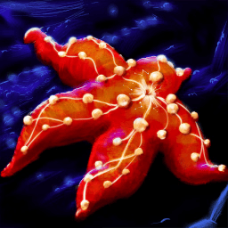

#  Starfish

[](LICENSE)
[](https://dotnet.microsoft.com/download/dotnet/10.0)

Starfish is a dependency visualizer for Arch Linux. It allows you to explore the complex web of package relationships on your system through an intuitive graphical interface.


## Features

- **Interactive Dependency Graphs**: Visualize package dependencies and "required by" relationships.
- **ALPM Integration**: Directly interfaces with the Arch Linux Package Management (ALPM) library (through shelly).
- **High Performance**: Built with .NET 10 and GTK 4, utilizing hardware acceleration for smooth graph rendering.
- **Deep Exploration**: Traverse through multiple levels of dependencies to understand your system's structure.
- **Installed vs. Available**: Easily distinguish between installed packages and available ones in the repositories.

## Getting Started

### Prerequisites

- **Arch Linux** (or an Arch-based distribution)

### Arch Linux (AUR)

Starfish is available in the Arch User Repository (AUR). You can install it using Shelly or an AUR helper like `paru` or `yay`

### Building from Source

If you are a developer or want to build Starfish from source, you can use the provided installation script:

```bash
git clone https://github.com/seafoamlabs/Starfish.git
cd Starfish
sudo ./local-install.sh
```

This script will build the project, install it to `/opt/starfish`, create a symlink in `/usr/bin/starfish`, and add a desktop entry to your application menu.

---

Developed by [Seafoam Labs](https://github.com/seafoamlabs)
